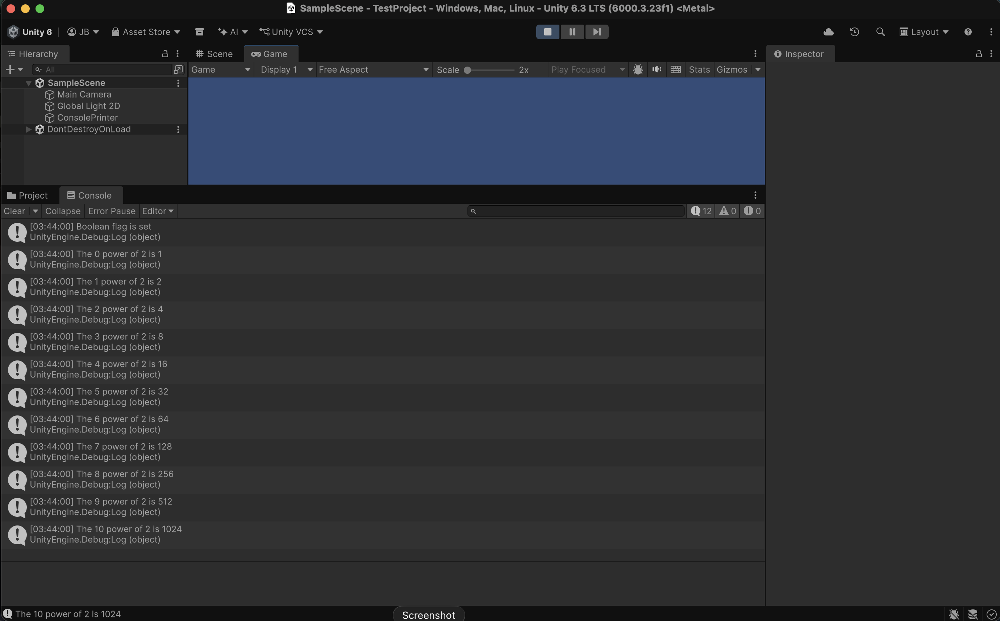

# Repository_Test_JamesBenson

Hey! My name is James Benson and in this repository you will find a unity 2d project, a .gitignore file, a folder called "Images", and this README.md.

All of this is listed as required by the notion site for homework, so if confused please go back to website.

<h6>First Photo</h6>

<h6>Second Photo</h6>

